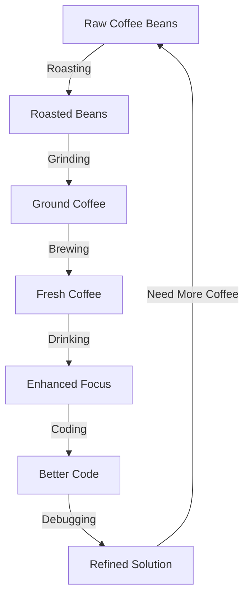

Welcome to a unique blog where we explore programming concepts through the lens of coffee brewing. Whether you're a software developer who loves coffee or a barista curious about coding, you'll find something interesting here.

## Latest Articles

Here are some of our recent deep dives:
- [[01-cappuccinos-and-css-grid|Mastering CSS Grid Like a Cappuccino Artist]] 
- [[02-from-beans-to-build-time|Build Time Optimization: From Coffee Beans to Code]]
- [[03-latte-foam-and-lambda-functions|The Art of Lambda Functions]]

## The Coffee-Code Process

## Why Coffee & Code?

> [!note] Perfect Pairing
> Coffee and programming go hand in hand. Both require attention to detail, precise measurements, and a passion for crafting something amazing.

> [!tip] Productivity Boost
> Studies show that moderate coffee consumption can improve focus and problem-solving abilities. Just remember to stay hydrated!

> [!warning] Coffee First, Code Later
> Never attempt to debug production issues before your morning coffee. Trust us on this one! 

> [!danger] Common Pitfalls
> - Over-caffeination leads to jittery coding
> - Cold coffee = cold code
> - Running out of beans during a coding sprint

## Meet Our Team

Our articles are written by experienced developers who are also certified coffee enthusiasts. Meet [[julie|Julie]], our lead developer and resident coffee expert who believes that the best code reviews happen over a well-brewed pour-over.

## Featured Topics

| Coffee Concept | Programming Parallel |
|---------------|---------------------|
| Brewing Time | Build Time |
| Bean Quality | Code Quality |
| Grind Size | Code Granularity |
| Temperature | Performance |
| Extraction | Optimization |

> [!quote] As Julie always says...
> "The best code, like the best coffee, is crafted with patience, precision, and passion."

---

Join us on this caffeinated journey through the world of software development! 🚀
