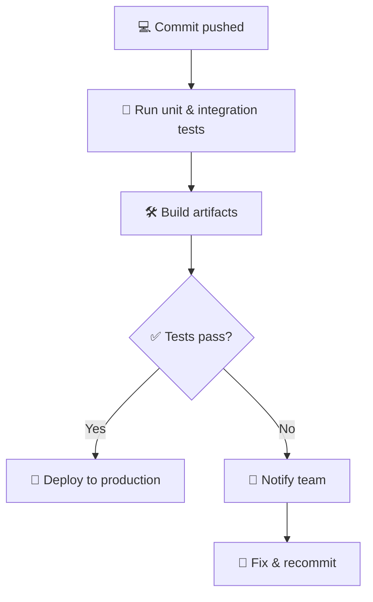

# CI/CD & Cortados: A Love Story

When the afternoon slump looms, I wander to my neighborhood café for a **cortado**—equal parts bold espresso and silky steamed milk. It’s the perfect balance: no sugar rush, no milk overload, just a smooth jolt that lets me push code to prod with steady hands. Over time, I realized my *ideal* CI/CD pipeline feels a lot like that cortado: small, balanced, and delightfully reliable.

> [!quote] Caffeine & Commits  
> “Ship small, stay warm.” — a barista-turned-engineer friend of mine.

---

## The Ingredients

| Cortado Component | Pipeline Parallel |
| --- | --- |
| **1 shot espresso** (intense flavor) | **Unit tests** (quick validation) |
| **1 shot steamed milk** (smooth finish) | **Automated build & deploy** (polished delivery) |
| **4 oz glass** (compact vessel) | **Lightweight workflow file** (single-page GitHub Action) |

> [!tip] Keep It Single-Origin  
> Stick to one CI service (e.g., GitHub Actions) unless you *really* need a multi-cloud setup. The fewer beans you blend, the clearer the flavor.

---

## The Flow at a Glance

> [!info] Tiny but Mighty  
> A cortado is only ~120 ml, yet packs all the punch of a full latte. Likewise, this pipeline averages **3–4 minutes** per run—fast enough for trunk-based development.

---

## Brew-Inspired Best Practices

1. **Pre-warm the cup** → *Cache dependencies*.  
   Warming a glass keeps espresso from cooling too fast; caching NPM/PyPI packages shaves ~40 s from each build.  

2. **Steam *just* to 60 °C** → *Fail fast*.  
   Over-heated milk scalds; long-running flaky tests sour dev morale. Aim for crisp, deterministic checks.  

3. **Serve immediately** → *Auto-deploy on merge*.  
   Milk and coffee separate if they sit. So does fresh code. Ship while it’s hot.

> [!caution] Protect Secrets  
> Even a tiny spill can ruin your laptop—and a leaked API key can ruin your week. Use encrypted store variables and rotate often.

---

## My Daily Ritual

1. **Commit & Push** – Fingers fly, latte art inspiration looms.  
2. **Order Cortado** – 90 seconds at the bar; pipeline already in motion.  
3. **Sip & Watch** – By the fourth sip the tests are green.  
4. **Celebrate the Deploy** – Cortado finished, feature live, caffeine level perfect.  

---

> [!success] Sweet Spot Achieved  
> After a month of pairing cortados with trunk-based CI/CD, our average *time to prod* dropped from **22 min to 8 min**. The café knows my order by heart, and prod incidents dropped by 35%.

**Final Sip**  
A good cortado doesn’t hide flaws—it spotlights them in a smaller cup. Your CI/CD should do the same: expose issues early, deliver flavor quickly, and leave you energized, not jittery. Next time you brew a tiny espresso-milk masterpiece, think about squeezing unnecessary steps out of your pipeline. Small cup, small diff, big payoff.